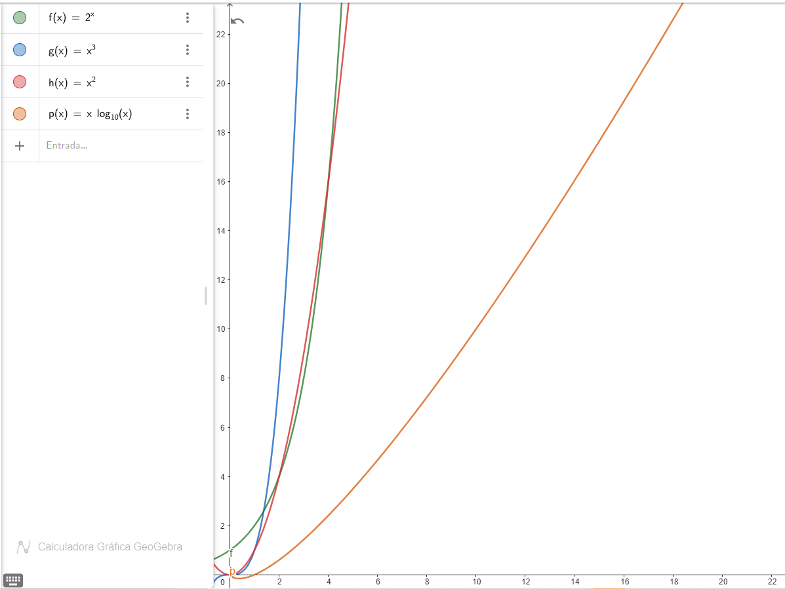

# Desafío teórico
## Procesos, hilos y corutinas
### Un caso en el que usarías procesos para resolver un problema y por qué.
> Utilizaría `multiprocessing` para realizar en paralelo el procesamiento de datos, si este implica procesos complejos o demandantes para la CPU, y es independiente de los demás elementos de datos. Por ejemplo, si necesito aplicar varias transformaciones y filtros a las imágenes de un set de imágenes, lo haría con `multiprocessing`. Esto se debe a que procesar cada imagen es un trabajo demandante para la CPU, por lo cual mientras un núcleo del CPU está ocupado procesando una imagen, puedo sacarle provecho a los demás núcleos disponibles para procesar el resto de imágenes en paralelo. Además, dado que las acciones son independientes y no es necesario compartir datos entre los procesos, se le puede sacar el máximo provecho a la paralelización.

### Un caso en el que usarías threads para resolver un problema y por qué.
> Utilizaría `multithreading` para realizar una secuencia de operaciones sobre una serie de datos. Estas operaciones pueden que no sean tan demandantes para la CPU, pero pueden potencialmente tener varios tiempos muertos como wait times, operaciones de lectura o escritura de archivos, o consumir servicios web. Un ejemplo podría ser el desafío técnico, donde para cada ítem del archivo se tenían que hacer varios llamados a diferentes endpoints, y se podía aprovechar el tiempo de respuesta que toman estos llamados para ejecutar otros threads concurrentemente y así procesar el archivo completo más rápido.

### Un caso en el que usarías corrutinas para resolver un problema y por qué.
> Utilizaría corutinas cuando, al igual que en el caso de los threads, necesite realizar una serie de operaciones que potencialmente tengan tiempos muertos del procesador en una serie de datos. Sin embargo, preferiría las corutinas sobre los threads en el caso en que quiera tener más control sobre la forma en la que se ejecutan (particularmente sobre en qué momento se cambia de una tarea a otra), o si el número de tareas a realizar es muy alto, ya que el uso de corutinas me permitiría un uso más eficiente de los recursos del sistema operativo. Un ejemplo de esto podría ser también el desafío técnico, donde si bien se utilizan threads para procesar cada chunk de ítems, se utiliza corutinas para realizar los diferentes llamados a las APIs y actualizar los valores de la información del ítem.

## Optimización de recursos del sistema operativo
### Si tuvieras 1.000.000 de elementos y tuvieras que consultar para cada uno de ellos información en una API HTTP. ¿Cómo lo harías? Explicar.
> La solución depende del contexto bajo el cual se quieren realizar las peticiones. Sin embargo, suponiendo que podemos disponer de todos los recursos de la máquina para realizar el procesamiento, y que el API de consulta no tiene ningún tipo de limitación, lo que yo haría sería dividir todos los elementos entre el número de cores de mi CPU para obtener chunks que se van a procesar de manera paralela en procesos diferentes, y luego, para cada chunk haría los llamados a API de manera concurrente utilizando subrutinas.

## Análisis de complejidad
### Dados 4 algoritmos A, B, C y D que cumplen la misma funcionalidad, con complejidades O(n^2), O(n^3), O(2^n) y O(n log n), respectivamente, ¿Cuál de los algoritmos favorecerías y cuál descartarías en principio? Explicar por qué. 
> Favorecería el algoritmo D, ya que, como se puede observar en la gráfica generada con [Geogebra](https://www.geogebra.org/graphing?lang=es), es el que tiene una menor complejidad a medida que aumentan los elementos. De la misma forma, descartaría el algoritmo C ya que es el que más rápido crece en complejidad en comparación a los demás.

### Asume que dispones de dos bases de datos para utilizar en diferentes problemas a resolver. La primera llamada AlfaDB tiene una complejidad de O(1) en consulta y O(n^2) en escritura. La segunda llamada BetaDB que tiene una complejidad de O(log n) tanto para consulta, como para escritura. ¿Describe en forma sucinta, qué casos de uso podrías atacar con cada una?
> Utilizaría AlfaDB para casos donde tenga un volumen de datos muy grande que necesite estar consultando constantemente, pero que dichos datos no cambien mucho en el tiempo y/o que cuando haya cambios o información nueva no sea prioritario que esta se refleje en la base de datos de forma inmediata.
Por otro lado, utilizaría BetaDB para casos en los que voy a estar tanto leyendo como escribiendo información constantemente en la base de datos, y sea prioridad tener la información nueva o actualizada disponible lo más pronto posible.